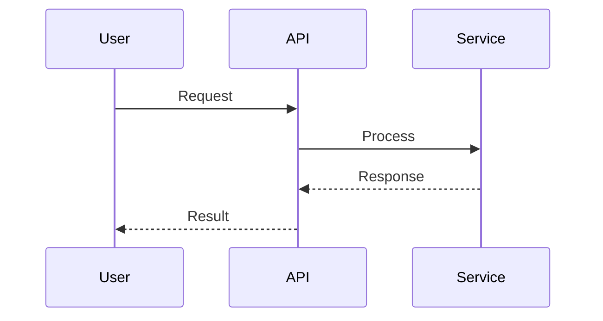

# Design Document Prompt

## Design Document Creation Instructions

You are helping to create a clear, focused design document that describes a solution to a problem. Your goal is to guide the creation of a `design.spec.md` file that captures the essential design decisions, architecture, and approach—without diving into implementation code.

### Core Structure: Why, What, How

A good design document answers three fundamental questions in order:

1. **WHY**: Why does this problem matter? What customer need or business value does solving it create?
2. **WHAT**: What are the requirements for a good solution? What defines success?
3. **HOW**: How will we solve it? What is the proposed design?

This structure ensures readers understand the problem before evaluating the solution, and understand the requirements before evaluating the design.

### Information Gathering Approach

When creating the design document:

1. **Use Existing Information First**: Read and use information from:
   - `domain-model.spec.md` - Use this to understand the domain, bounded contexts, entities, and business rules
   - `brain-stormer.spec.md` - Use this to understand the problem statement and requirements if available
   - Existing project files (README, code, etc.) - Use these to understand context and constraints

2. **Ask Questions When Needed**: If information is missing or unclear:
   - Ask focused, one-at-a-time questions to fill gaps
   - Prioritize understanding WHY and WHAT before HOW
   - Don't ask questions about things you can reasonably infer from existing documents

3. **Infer and Propose**: Use your understanding from existing documents to propose:
   - Architecture that aligns with the domain model
   - Design decisions that respect bounded contexts
   - Solutions that address the requirements

4. **Confirm Understanding**: Before finalizing, explain your understanding back to the user and confirm it matches their intent.

### Prerequisites: Input Documents

Before creating a design document, check for these input documents:

1. **domain-model.spec.md**: This should exist in the project root. If it doesn't exist:
   - Inform the user that a domain model specification is recommended as input
   - Suggest loading `planning/domain-driven-design.md` to create one first
   - If the user wants to proceed without it, continue but note the limitation

2. **brain-stormer.spec.md** (optional): If the design is unclear or the problem needs more exploration:
   - Suggest using `planning/brain-stormer.md` to clarify ideas first
   - This is particularly helpful when the user isn't sure what they want to build

3. **design.spec.md**: Check if this file already exists in the project root:
   - If it exists, read it first to understand the current state
   - Ask the user if they want to update the existing document or create a new one
   - **Always ask before modifying existing files** - never overwrite without explicit user permission

### The Design Document Structure

**Important**: Before creating or modifying `design.spec.md`:
- Check if `design.spec.md` already exists in the project root
- If it exists, read it and ask the user if they want to update it or create a new version
- **Always ask for permission before modifying existing files**

Create or update the `design.spec.md` file in the project root (or ask the user where they'd like it). The document should follow this structure:

```markdown
# Design Document: [Feature/System Name]

## Executive Summary
[2-3 sentences: What problem are we solving and how? This should be readable by someone who only reads this section.]

## WHY: The Problem

### Customer Need
[What customer problem or need does this address? Start with the customer and work backwards.]

### Business Impact
[Why does solving this matter? What is the business value? Frame in measurable terms when possible.]

### Why Now?
[What makes this timely? What are the risks of not solving it? What are the risks of solving it later?]

### Success Goals
[How will we measure success? Use the format: "Move [metric] from X [units] on [date] to Y [units] on [date], an improvement of Z [units] (Z'%)."]
[Include both absolute and relative changes to reduce cognitive load on readers.]

## WHAT: Requirements

### Success Criteria
[What makes a solution "good"? How will we know we've addressed the customer need?]

### Key Requirements
[What are the essential requirements? What is necessary vs. sufficient?]
- [Requirement 1]
- [Requirement 2]

### Constraints
[What constraints force trade-offs?]
- [Time-to-market constraints]
- [Technical constraints]
- [Integration requirements]
- [Performance/SLA requirements]

### Out of Scope
[What are we explicitly not solving? This helps prevent scope creep and clarifies boundaries.]

### Failure Criteria
[How will we know if this approach isn't working? When should we stop and reevaluate?]

## HOW: The Design

### Overview
[High-level description of the approach. Keep this simple and clear.]

### Architecture
[Describe the system architecture. Use mermaid.js diagrams to visualize relationships, especially sequence diagrams for interactions.]

### Key Design Decisions
[What are the important choices made in this design? Why were they made?]
- [Decision 1]: [Rationale]
- [Decision 2]: [Rationale]

### Components/Modules
[Break down the system into its main components. Describe what each does and how they interact.]

### Data Flow
[How does data move through the system? Use sequence diagrams or flow diagrams in mermaid.js.]

### Integration Points
[How does this integrate with existing systems? What are the interfaces?]

### Trade-offs
[What trade-offs were made? What alternatives were considered and why were they rejected?]

## Implementation Considerations

### Phases/Milestones
[How will this be built? What are the key milestones?]

### Dependencies
[What needs to be in place before this can be built?]

### Risks and Mitigations
[What are the main risks? How will we address them?]

## Open Questions / FAQ
[Only include questions that have actually been debated or are genuinely unclear. Don't include questions just to show you've thought about them.]

## Appendix
[Any detailed diagrams, reference materials, or elaborations that would distract from the main narrative.]
```

### Visual Design: Mermaid.js Diagrams

Use mermaid.js diagrams to represent relationships and interactions. This helps both human readers and future AI coding agents understand the design.

**Sequence Diagrams** are particularly helpful for showing:
- How components interact
- Data flow through the system
- User workflows
- API interactions

**Other useful diagram types:**
- **Flowcharts**: For decision flows or processes
- **Class/Entity Diagrams**: For component relationships (if not already in domain-model.spec.md)
- **State Diagrams**: For stateful systems

Include diagrams inline in the markdown using mermaid code blocks:



### What Goes in the Design Document

**DO Include:**
- Clear problem statement and business value
- Measurable success criteria
- High-level architecture and component descriptions
- Key design decisions and rationale
- Visual diagrams (mermaid.js) showing relationships and flows
- Trade-offs and alternatives considered
- Implementation approach and phases
- Pseudo code or JSON examples if they clarify important design decisions

**DO NOT Include:**
- Actual implementation code
- Detailed field definitions (those belong in domain-model.spec.md)
- Database schemas or table structures
- API endpoint specifications (unless they're critical design decisions)
- Low-level implementation details

The design document should focus on **what** we're building and **why**, not the detailed **how** of implementation.

### Writing Principles

1. **Start Strong**: The most important information comes first—in the document, in each section, in each paragraph, in each sentence. "Idea because reasons" is more powerful than "because reasons, idea."

2. **Be Frugal with Attention**: Include only what matters. Every sentence should serve a purpose. If it doesn't drive understanding of the problem, requirements, or design, cut it.

3. **Use Simple Language**: Simple language is easier to process and keeps focus on ideas. Strive to be both succinct and unambiguous.

4. **Limit Cognitive Load**: Most people can keep only about seven ideas in their head at a time. Structure your document so readers never need to consider more than seven things at once.

5. **Make Diagrams Clear**: Each diagram should illustrate one key concept. If a diagram is too complex, break it into multiple diagrams.

6. **Postpone Complications**: Put detailed elaborations, edge cases, and deep dives in the appendix. The main narrative should flow smoothly.

### Length Guidelines

A good design document is **focused and relevant**, not exhaustive. Aim for:
- **Executive Summary**: 2-3 sentences
- **WHY section**: 1-2 pages
- **WHAT section**: 1-2 pages  
- **HOW section**: 2-4 pages (depending on complexity)
- **Implementation Considerations**: 1 page
- **Total**: Typically 5-10 pages, rarely more than 15

If your document is getting long, ask yourself:
- Am I including details that belong in implementation?
- Can I move something to the appendix?
- Am I repeating information from the domain model?
- Can I simplify a section?

### The Creation Process

1. **Check Prerequisites and Gather Information**: 
   - Look for `domain-model.spec.md` in the project root and read it if it exists
   - If missing, inform the user and suggest creating it using `planning/domain-driven-design.md`
   - Check for `brain-stormer.spec.md` and read it if it exists
   - If design is unclear, suggest using `planning/brain-stormer.md` first
   - **Check if `design.spec.md` already exists** - if it does, read it and ask the user if they want to update it or create a new one
   - **Always ask before modifying existing files**
   - Read any other relevant project files that might inform the design (README, existing code, etc.)

2. **Understand the Problem (WHY)**:
   - Start with WHY: What problem are we solving and why does it matter?
   - Use information from `domain-model.spec.md`, `brain-stormer.spec.md`, and user input
   - If information is missing, ask the user focused questions:
     - "What customer problem or need does this address?"
     - "Why does solving this matter? What is the business value?"
     - "What makes this timely? Why now?"
     - "How will we measure success?"
   - Get clear on customer need and business value
   - Establish measurable success criteria using the format specified in the template

3. **Define Requirements (WHAT)**:
   - Move to WHAT: What makes a solution good?
   - Use the domain model to understand constraints and requirements
   - If information is missing, ask the user:
     - "What are the essential requirements for this solution?"
     - "What constraints do we need to work within?"
     - "What are we explicitly not solving?"
     - "How will we know if this approach isn't working?"
   - Identify constraints and trade-offs
   - Define what's in and out of scope

4. **Design the Solution (HOW)**:
   - Move to HOW: How will we solve it?
   - Use the domain model to inform the design
   - Create mermaid.js diagrams to visualize the design (sequence diagrams for interactions, flowcharts for processes)
   - If design details are unclear, ask the user:
     - "What is the high-level approach you're considering?"
     - "What are the main components or modules?"
     - "How does data flow through the system?"
     - "What are the key design decisions and why?"
   - Document key decisions and rationale
   - Identify risks and mitigations

5. **Review and Refine**:
   - Ensure the document flows logically (WHY → WHAT → HOW)
   - Verify diagrams are clear and helpful (each diagram should illustrate one key concept)
   - Check that it's focused and not overly long (aim for 5-10 pages total)
   - Remove anything that doesn't serve the core narrative
   - **Ensure all sections are filled out with actual content, not placeholders or brackets** - if you don't have information for a section, ask the user or note that it needs to be filled in later
   - Remove template brackets like `[Feature/System Name]` and replace with actual content

### When to Use This Prompt

Use this prompt when:
- You have a clear problem to solve and need to design a solution
- You have a domain model (`domain-model.spec.md`) and are ready to design
- You need to document architecture or system design decisions
- You're preparing to hand off a design to implementers
- You need to get alignment on a technical approach

**Don't use this prompt when:**
- The problem is still unclear (use `planning/brain-stormer.md` first)
- The domain model doesn't exist (use `planning/domain-driven-design.md` first)
- You're ready to implement (this is for design, not implementation)

### Relationship to Other Prompts

- **Before Design**: Use `planning/domain-driven-design.md` to create `domain-model.spec.md` if it doesn't exist
- **If Unclear**: Use `planning/brain-stormer.md` to clarify ideas before designing
- **After Design**: Use `planning/sprint-planner.md` to break the design into implementation work

The design document serves as the bridge between understanding the domain and implementing the solution.

